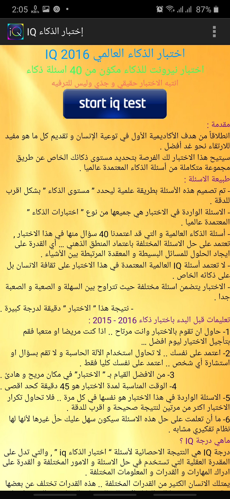
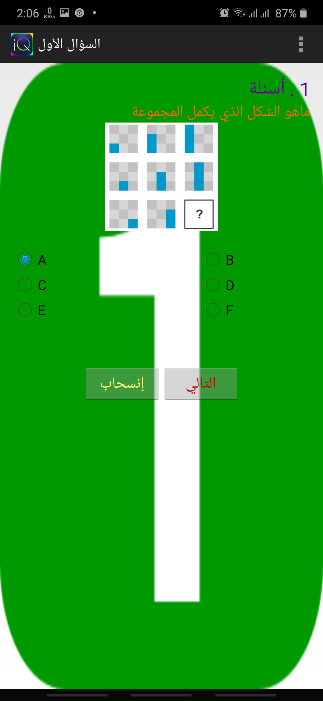
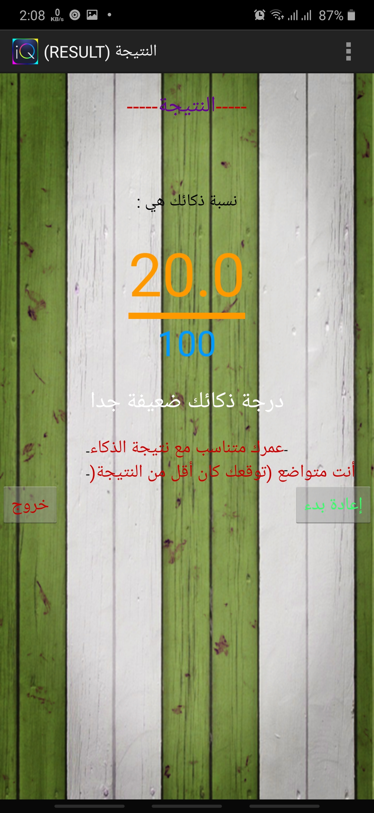

# IQ-Android
A simple android application for IQ tests, contains 40 questions and issues. 

#### Compatible with **API Level 14** and higher
#### Support only arabic language

### Features 🚀
- show iq tests as multiple choice questions
- show the result
- re-test
- support buttons sounds
- support two languages **arabic & english**

## Screenshots 🎉
Intro  |  Test  |  Test  |  Result
:-------------------------:|:-------------------------:|:-------------------------:|:-------------------------:
  |    |    |  

